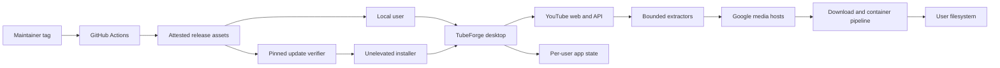

# TubeForge threat model

## Executive summary

TubeForge is a local single-user Windows desktop application with no hosted backend, accounts, authentication, or multi-tenancy. Its main risks are processing attacker-influenced YouTube/player/media bytes, safely constraining network destinations and filesystem writes, protecting privacy-bearing local state, and preserving release integrity. Existing allowlists, size/depth bounds, constrained non-executing JavaScript plans, atomic file publication, dependency rejection, checksums, and build attestations reduce all identified v1 threats to medium or low priority; no critical/high residual threat was found under the confirmed public single-user deployment model.

## Scope and assumptions

- In scope: `src/`, `scripts/`, `.github/workflows/`, runtime persistence, public release artifacts, and the supported Windows x64 desktop deployment.
- Out of scope: YouTube infrastructure, Windows/.NET platform vulnerabilities, DRM/login/private/paid media, active-live capture, social/legal misuse, and attackers who already control the user's Windows account or administrator context.
- Confirmed: binaries may be used by unrelated users, but each instance is local, single-user, and keeps private per-user state; no hosted service or shared database exists.
- Data sensitivity: ordinary personal data in local titles, video IDs, destination paths, and history; no intended credentials, cookies, regulated records, or payment data.
- Attacker-controlled inputs: pasted URLs, upstream HTML/JSON/player JavaScript/media/container/caption/thumbnail bytes, redirects, and public issue contents.
- Confirmed: the per-user installer remains unelevated; update checks are opt-in, accept only the pinned TubeForge GitHub repository and asset policy, verify two matching SHA-256 records, and require explicit confirmation before execution.
- Open question: a future login feature, shared-machine deployment, elevated process, silent update, or alternate update source would require a new threat model and could materially raise risk.

## System model

### Primary components

- WPF desktop/UI and orchestration: `src/TubeForge.App/App.xaml.cs::App_OnStartup` and `src/TubeForge.App/ViewModels/MainViewModel.cs::AnalyzeAsync`.
- URL/domain validation and ranking: `src/TubeForge.Core/YouTube/` and `src/TubeForge.Core/Media/`.
- YouTube extraction, collection parsing, constrained player transforms, and sidecars: `src/TubeForge.YouTube/`.
- Direct/segmented transfer, persistence, disk policy, and adaptive orchestration: `src/TubeForge.Downloads/`.
- In-house MP4/WebM parsers and muxers: `src/TubeForge.Media/`.
- Repository-pinned update discovery, download, and verification: `src/TubeForge.Updates/`.
- Per-user install, repair, update, and uninstall: `src/TubeForge.Installation/` and `src/TubeForge.Installer/`.
- Release build, verification, CI, and provenance: `scripts/Publish-Release.ps1`, `scripts/Test-Release.ps1`, and `.github/workflows/`.

### Data flows and trust boundaries

- User → WPF application: pasted YouTube URL, destination, mode/filter/settings over in-process UI binding; strict URL parsing and normalized path/filename handling.
- WPF application → YouTube: public identifiers and bounded requests over HTTPS; no account credential or cookie import; per-provider concurrency and retry bounds.
- YouTube → extractors: untrusted HTML, JSON, player JavaScript, caption, and thumbnail bytes over HTTPS; host checks, response limits, JSON depth limits, and constrained token/operation plans.
- Extractors → Google media hosts: signed media URLs over HTTPS; exact `googlevideo.com` suffix allowlist and redirect revalidation.
- Media hosts → transfer/container code: untrusted byte streams over HTTPS; length/range validation, bounded parsers, partial files, container validation, and atomic finalization.
- Application → per-user disk: settings, queue, Library history, partial files, and completed output through Windows filesystem APIs; schema validation, backup/pending recovery, and collision-safe names.
- GitHub release → updater → installer: repository-pinned stable metadata and bounded assets over HTTPS; exact name/version/size policy, GitHub digest plus checksum agreement, staged download, and explicit user confirmation.
- Maintainer/tag → GitHub Actions → users: source, Microsoft runtime packs, ZIP/installer artifacts, checksums, provenance attestations, and optional Authenticode signatures; constrained workflow permissions and release verification.

#### Diagram

## Assets and security objectives

| Asset | Why it matters | Security objective (C/I/A) |
|---|---|---|
| Downloaded media and sidecars | User-selected output must be correct and not replace unrelated files | I/A |
| Queue, settings, and Library | Contains personal titles, IDs, paths, history, and recovery state | C/I/A |
| Extraction decisions and signed URLs in memory | Wrong transforms can break downloads or redirect traffic | C/I/A |
| Application process and user account | Parser or shell misuse must not execute attacker code | C/I/A |
| Release binaries/checksums | Users must receive code built from the intended tag | I/A |
| Repository/workflows/signing key | Compromise could produce trusted malicious releases | C/I |

## Attacker model

### Capabilities

- Publish or influence a public URL that the user pastes, and control bytes returned by a compromised/malicious upstream or redirect endpoint within the accepted domain boundaries.
- Supply malformed, oversized, deeply nested, truncated, or adversarial player/media/container data.
- Cause network stalls, truncation, retries, rate limits, and disk-pressure conditions.
- Convince a user to share issue content or diagnostic material.
- With separate local access, race or modify files writable by the same Windows user.

### Non-capabilities

- No assumed administrator access, pre-existing code execution, control of the user's Windows account, GitHub maintainer credentials, or certificate private key.
- No direct inbound network listener, web API, shared tenant, account/session boundary, or privileged service exists.
- YouTube/Google TLS and Windows/.NET integrity are treated as platform dependencies rather than reimplemented trust anchors.

## Entry points and attack surfaces

| Surface | How reached | Trust boundary | Notes | Evidence (repo path / symbol) |
|---|---|---|---|---|
| Video/collection URL | Paste into desktop UI | User → app | Host/path/ID shapes are strict | `src/TubeForge.Core/YouTube/YouTubeUrlParser.cs::ParseVideoId`; `YouTubeCollectionUrlParser.cs::Parse` |
| Watch/API/collection responses | HTTPS requests | Internet → extractor | Bounded reads and JSON depth | `src/TubeForge.YouTube/YouTubeMetadataResolver.cs::ResolveAsync`; `Collections/YouTubeCollectionResolver.cs` |
| Player JavaScript | Player script URL in watch response | Internet → transform planner | Tokenized and constrained; never executed | `src/TubeForge.YouTube/Player/JavaScriptTokenizer.cs::TryTokenize`; `SignatureTransformExtractor.cs::Extract` |
| Media URLs/redirects | Parsed stream metadata | Extractor → downloader | HTTPS Google media allowlist checked before and after redirect | `src/TubeForge.Downloads/DownloadUriPolicy.cs::IsAllowed`; `DirectDownloadEngine.cs::DownloadAttemptAsync` |
| MP4/WebM bytes | Downloaded tracks | Internet → parser/muxer | Bounded box/element parsing and atomic output | `src/TubeForge.Media/IsoBmff/`; `src/TubeForge.Media/Ebml/` |
| Destination and filename | User selection plus metadata | App → filesystem | Full-path normalization, safe extension/stem, no overwrite | `src/TubeForge.Core/Files/FileNamePolicy.cs`; `DirectDownloadEngine.cs::FinalizeCompletedPartial` |
| Local JSON state | App startup and queue changes | Filesystem → app | Schema/depth/size validation and crash recovery | `src/TubeForge.Downloads/Queue/DownloadQueueStore.cs`; `History/DownloadHistoryStore.cs`; `src/TubeForge.Core/Settings/TubeForgeSettingsStore.cs` |
| Diagnostics/issues | Explicit user export/share | App → user/GitHub | Whitelist-only report; local state itself is more sensitive | `src/TubeForge.Core/Diagnostics/RedactedDiagnosticReportBuilder.cs::Build` |
| Release tag/workflow | Maintainer pushes tag | Repository → users | Build/test/checksum/attestation/release pipeline | `.github/workflows/release.yml`; `scripts/Publish-Release.ps1` |
| Update metadata and installer | Opt-in app check or manual release download | GitHub → app → user account | Pinned repository/assets, digest/checksum agreement, bounded staging, explicit execution | `src/TubeForge.Updates/GitHubUpdateClient.cs`; `GitHubReleasePolicy.cs`; `src/TubeForge.Installation/` |

## Top abuse paths

1. Attacker supplies a public URL → upstream response contains hostile player script → tokenizer/planner is stressed → analysis consumes resources or fails. Impact: local availability; bounds and unsupported-syntax failure limit the path.
2. Compromised upstream returns a media redirect → downloader follows it → redirect targets a non-Google host. Impact sought: SSRF/data fetch; post-redirect allowlist rejects it before body processing.
3. Hostile MP4/WebM stream passes superficial MIME metadata → bounded parser/muxer processes malformed sizes/offsets → output corruption or CPU/disk exhaustion. Impact: local availability/output integrity; hostile-container tests and atomic finalization reduce risk.
4. Same-user local attacker changes destination/junction/state between validation and write → TubeForge writes within an unintended filesystem target. Impact: same-user file integrity; no overwrite and normal user privileges limit severity, but reparse-point races remain a residual gap.
5. User posts raw state or media URL while reporting a bug → identifiers, paths, or expiring signatures become public. Impact: privacy; explicit diagnostics whitelist and report guidance reduce likelihood.
6. Maintainer token/workflow/tag is compromised → malicious artifacts are published → users trust the GitHub release. Impact: code execution as user; protected credentials, tests, SHA-256 manifests, optional Authenticode, and GitHub attestations provide prevention/detection but repository governance remains critical.
7. Large batch plus network faults fills disk and recovery files → queue repeatedly retries/resumes → user disk/application availability degrades. Impact: local DoS; concurrency, retry, rate, disk-forecast, and state-size limits constrain it.
8. Compromised or spoofed release metadata offers an installer → updater validates repository, stable version, exact asset name/size, API digest, and checksum manifest → mismatches fail closed before explicit execution. Impact sought: code execution as user.

## Threat model table

| Threat ID | Threat source | Prerequisites | Threat action | Impact | Impacted assets | Existing controls (evidence) | Gaps | Recommended mitigations | Detection ideas | Likelihood | Impact severity | Priority |
|---|---|---|---|---|---|---|---|---|---|---|---|---|
| TM-001 | Malicious/changed upstream player | User analyzes attacker-influenced public media | Send pathological or semantically deceptive JS/JSON to exhaust or confuse extraction | Analysis failure or local DoS; wrong transform candidate | Process availability, extraction integrity | 6 MiB/token/operation/body bounds and no JS execution (`JavaScriptTokenizer`, `SignatureTransformExtractor`); probe before cache (`YouTubeMetadataResolver`) | Required JS subset and upstream shapes evolve | Keep synthetic mutation/fuzz corpus; cap total analysis wall time/memory; require probe and host validation for new operations | Typed extraction stage, plan/probe counts, canary failures | Medium | Medium | medium |
| TM-002 | Malicious media bytes | Accepted Google media response is hostile or compromised | Abuse MP4/WebM lengths, nesting, offsets, or fragmentation | CPU/memory/disk DoS or corrupt output | Process availability, output integrity | Bounded readers, 64 MiB metadata ceilings, hostile mutation tests, temp output then atomic move (`src/TubeForge.Media/`) | Complex parser surface remains | Continue coverage-guided deterministic mutations; add per-operation mux time/size ceilings if real samples expose hotspots | Container validation failure codes; no final file on failure | Medium | Medium | medium |
| TM-003 | Redirect/metadata attacker | Stream or sidecar URL redirects | Redirect downloader to localhost, LAN, metadata service, or arbitrary host | SSRF or unwanted content fetch | User network, process | HTTPS and exact host suffix policy; redirect revalidation (`DownloadUriPolicy`, `DirectDownloadEngine`) | DNS rebinding/IP class is not independently pinned after TLS host validation | Keep host allowlist narrow; never add arbitrary proxy URLs or user-defined hosts without a separate policy | `Download.UnsafeRedirect`; sanitized aggregate diagnostics | Low | Medium | low |
| TM-004 | Same-user local attacker/race | Attacker can modify user-writable destination/state during operation | Swap junction/reparse target or state between validation and file operation | Write/delete within another same-user-accessible location; lost partial state | Output and local state integrity | Full-path normalization, child naming, no-overwrite final move, schema validation, fixed recovery siblings | Reparse points and TOCTOU are not opened with handle-relative anti-race semantics | Before installer/enterprise use, reject reparse-point destinations or use handle-based finalization; keep app unelevated | Destination/finalization failures; unexpected canonical path review | Low | Medium | low |
| TM-005 | Local corruption or untrusted state copy | Attacker can write `%LOCALAPPDATA%\TubeForge` | Insert oversized/malformed queue/settings/history or privacy-bearing values | Startup degradation, state loss, misleading UI, privacy exposure | Local state C/I/A | File-size/depth/schema/path/identity validation; pending/backup recovery (`*Store.cs`) | State is not encrypted or authenticated | Document same-user boundary; consider DPAPI only if future credentials exist; never store cookies/signatures | Typed persistence failure; preserve corrupt file for manual review | Low | Low | low |
| TM-006 | Compromised maintainer/workflow dependency | Repository/tag/token/action supply chain compromised | Build and publish altered executable under trusted release | Code execution as downloading user | Release integrity, user account | Read-only CI; tag release build/test; deterministic ZIP; SHA-256 manifest; `actions/attest@v4`; optional Authenticode (`release.yml`, `Publish-Release.ps1`) | Action tags are major-version references; no branch protection evidence in repo; signing cert not currently present | Enable protected `main`/tags and required reviews; pin actions to reviewed commit SHAs; use environment approval for stable release; protect signing key hardware/secret | Verify GitHub attestation/checksum; compare deterministic rebuild; monitor release/tag events | Low | High | medium |
| TM-007 | User/upstream availability abuse | Large batch, stalls, truncation, rate limits, low disk | Consume sockets, disk, queue state, or retry time | Local resource exhaustion and failed downloads | Availability, user disk | 1–4 queue concurrency, per-host gate, bounded retries/`Retry-After`, cancellation, disk forecasting, resumable state | Forecast is advisory when remote sizes unknown; no global byte quota | Keep unknown-size warning visible; add optional per-job/global byte caps if demanded | Queue failure counts, disk-space typed errors, performance/soak tests | Medium | Low | low |
| TM-008 | User disclosure mistake | User shares raw state, screenshot, URL, or media instead of redacted report | Expose titles, IDs, paths, signatures, private context, or copyrighted bytes | Privacy/copyright harm | Personal local data | Explicit whitelist diagnostics and issue template (`RedactedDiagnosticReportBuilder`, `.github/ISSUE_TEMPLATE/extractor.yml`) | Clipboard/screenshots and local JSON remain outside enforcement | Keep report workflow prominent; add confirmation preview before export if fields expand | Manual issue moderation; schema exclusion tests | Low | Medium | low |

## Criticality calibration

- Critical: unauthenticated remote code execution from a pasted URL; stable release-signing key theft enabling broadly trusted malware; arbitrary privileged file overwrite. No current finding meets this bar.
- High: reliable code execution as the desktop user from media bytes; release compromise with realistic maintainer-token path; broad exfiltration of future credentials. Current release compromise is medium because it requires privileged repository control and has attest/checksum detection.
- Medium: remotely triggerable application DoS; corruption of selected output; privacy exposure of titles/paths; same-user filesystem race with meaningful loss. TM-001, TM-002, and TM-006 fit this concern range before existing-control adjustment.
- Low: bounded analysis/download failure, recoverable queue corruption, noisy local resource use, or issues requiring same-user write access with no privilege gain. Most residual v1 threats fit here.

## Focus paths for security review

| Path | Why it matters | Related Threat IDs |
|---|---|---|
| `src/TubeForge.YouTube/YouTubeMetadataResolver.cs` | Network trust, bounded responses, transform selection, probe/cache behavior | TM-001, TM-003 |
| `src/TubeForge.YouTube/Player/` | Attacker-influenced JavaScript tokenizer and constrained evaluator | TM-001 |
| `src/TubeForge.YouTube/Extraction/YouTubeWatchPageParser.cs` | Large untrusted HTML/JSON mapping and media URL acceptance | TM-001, TM-003 |
| `src/TubeForge.Downloads/DirectDownloadEngine.cs` | Redirect policy, resume validators, partial/final file transition | TM-003, TM-004, TM-007 |
| `src/TubeForge.Downloads/SegmentedDownloadEngine.cs` | Concurrent ranges, state integrity, disk/resource behavior | TM-004, TM-007 |
| `src/TubeForge.Downloads/DownloadUriPolicy.cs` | SSRF boundary and allowed transport/host set | TM-003 |
| `src/TubeForge.Media/IsoBmff/` | Complex untrusted MP4 sizes, offsets, and mux output | TM-002 |
| `src/TubeForge.Media/Ebml/` | Complex untrusted WebM variable integers and nesting | TM-002 |
| `src/TubeForge.Downloads/Queue/DownloadQueueStore.cs` | Privacy-bearing crash-consistent state and path validation | TM-004, TM-005 |
| `src/TubeForge.Core/Diagnostics/RedactedDiagnosticReportBuilder.cs` | Privacy boundary for shared support data | TM-008 |
| `scripts/Publish-Release.ps1` | Runtime-pack restore, optional signing, deterministic archives/checksums | TM-006 |
| `.github/workflows/release.yml` | Tag-to-public-binary trust and workflow permissions | TM-006 |

## Quality check

- [x] Covered desktop, URL, network, parser, media, filesystem, state, diagnostics, and release entry points.
- [x] Represented every discovered runtime/build trust boundary in at least one threat.
- [x] Separated runtime behavior from CI/release tooling and tests.
- [x] Reflected confirmed public single-user, no-backend/no-auth deployment context.
- [x] Recorded assumptions and the future changes that require re-modeling.

